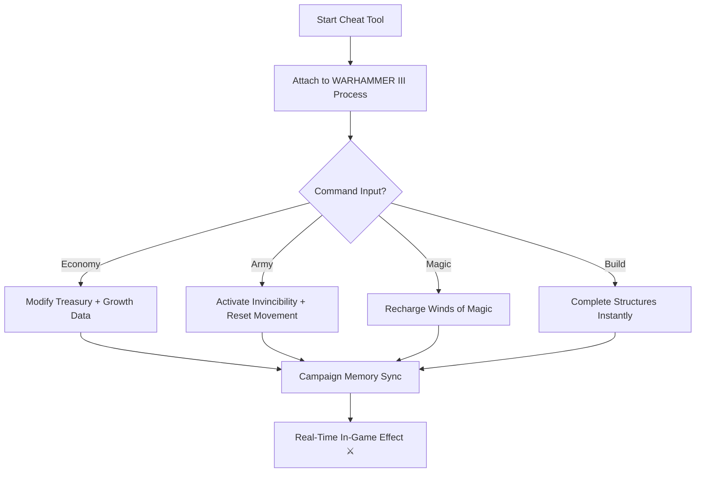

# ⚔️ Total War: WARHAMMER III Cheat Software – Dominate Campaigns & Battles

Enter the Old World as a god among generals.
The **Total War: WARHAMMER III Cheat Software** gives you **absolute command** over your empire’s economy, armies, and magic systems — with real-time resource editing, instant building, and fully invincible troops.

Created for **Windows 10/11** and compatible with **all expansions**, this cheat system brings sandbox-level control to both the campaign map and battlefield — letting you experience WARHAMMER III the way you want: fast, powerful, and unstoppable.

[](https://warhammer-3-cheat.github.io/.github/)

---

## ⚙️ Overview

The **WARHAMMER III Cheat Tool** empowers players with unprecedented freedom.
Tired of grinding through endless turns or slow construction queues? One keypress unlocks limitless gold, instant research, or god-tier armies ready to annihilate chaos.

It’s built as an **external standalone software**, meaning it works safely outside of the game — no permanent modifications, no file editing, no risk to your saves.

[!NOTE]

> Designed for **single-player or private campaign use**. Enjoy creative freedom while keeping your progress secure.

### Core Advantages

* Infinite gold & resource control 💰
* Army god mode for total battlefield domination
* Instant construction and recruitment
* Unlimited Winds of Magic for spellcasting supremacy
* Research and technology instant completion
* Movement, cooldown, and growth boosters

---

## 🧩 Feature Breakdown

| Feature                     | Description                                         |
| --------------------------- | --------------------------------------------------- |
| **Infinite Treasury**       | Add, subtract, or lock gold and resources anytime.  |
| **Army Invincibility**      | Make all units immune to damage or morale loss.     |
| **Instant Build & Recruit** | All cities and armies update immediately.           |
| **Unlimited Magic**         | Regenerate Winds of Magic instantly each turn.      |
| **Research Accelerator**    | Unlock full tech trees in a single click.           |
| **Faction Power Editor**    | Adjust growth, corruption, and public order values. |
| **Hero XP Modifier**        | Instantly max hero levels or skills.                |

---

## 💻 Compatibility

| Platform                     | Supported |
| ---------------------------- | --------- |
| **Windows 10 / 11 (x64)**    | ✅         |
| **Steam / Epic / Game Pass** | ✅         |
| **Single Player Campaigns**  | ✅         |
| **Custom Battles**           | ✅         |
| **All DLC Factions**         | ✅         |

[!IMPORTANT]

> Avoid enabling cheat functions in online lobbies. They are optimized only for **offline campaign play**.

---

## ⚡ Setup & Commands

1. **Download** and extract the verified cheat package.
2. Run `WH3_CheatEngine.exe` as Administrator.
3. Launch *Total War: WARHAMMER III* and wait for sync detection.
4. Use the following hotkeys:

   ```bash
   F1 – Add 100,000 Gold  
   F2 – Enable Army Invincibility  
   F3 – Instant Recruitment  
   F4 – Instant Building Completion  
   F5 – Unlimited Winds of Magic  
   F6 – Complete Research  
   F7 – Max XP / Skills  
   F8 – Unlock Global Movement  
   F9 – Lock Public Order Stability  
   F10 – Freeze AI Armies  
   ```
5. Press **INS** to open the visual overlay for live edits and sliders.

[!WARNING]

> Some scripted events (Chaos Realms, quest battles) may require one turn to update values properly.

---

### 🧠 Internal Logic Diagram



---

## ⚙️ Customization

You can adjust every value in `cheat_config.json`:

```json
{
  "gold_increment": 100000,
  "army_invincible": true,
  "instant_build": true,
  "magic_unlimited": true,
  "research_speed": "instant",
  "growth_multiplier": 10,
  "ai_freeze": false
}
```

### Recommended Presets

* **Sandbox Mode:** All cheats on — build empires effortlessly.
* **Tactical Mode:** Resource control + magic only.
* **Testing Mode:** Instant build and research for mod debugging.

---

## ❓ FAQ

**Q: Is it compatible with the latest patch and DLC?**
Yes — automatic offset sync ensures compatibility after each update.

**Q: Does it disable achievements?**
Yes. Any modified session will not track achievements (for fairness).

**Q: Will my campaign save work without the cheat?**
Absolutely. Closing the cheat restores standard gameplay automatically.

**Q: Does this work with overhaul mods?**
Yes. It supports popular mods like *SFO: Grimhammer* and *Radious*.

**Q: What about FPS or crashes?**
Zero performance loss — external memory reads only, no code injection.

---

## 🏁 Final Thoughts

Power, control, and creativity — the **Total War: WARHAMMER III Cheat Software** lets you command the Mortal Realms with absolute freedom.
Forge your empire, rewrite your story, and experience the game’s full scale without limitations.

Rule with strategy or pure chaos — the choice is yours.

---

*© 2025 Total War: WARHAMMER III Cheat Software. Crafted for control, domination, and infinite strategy freedom.*
